# 绘屿AI插件

该项目为ComfyUI自定义节点插件，旨在为[智慧引擎AI工具箱](https://huuuiai.com)提供本地部署能力，同时可以与绘屿AI（Photoshop）插件进行交互。

注意：该项目（包括[智慧引擎AI工具箱](https://huuuiai.com)本地服务）只限个人学习使用，禁止商业用途。如需商业用途，请联系``深圳智绘引擎科技有限公司``([联系方式](https://huuuiai.com/enterprise))进行授权使用。

© 深圳智绘引擎科技有限公司版权所有

## 安装方式

1. 打开ComfyUI Manager
2. 把地址填写进去`https://github.com/Joderxx/comfy-huiyu-node.git`
3. 重启Comfy UI
4. 在分类`绘屿AI`即可找到对应节点

##  使用方式
1. 启动ComfyUI
2. 编写自己的工作流，确保工作流包含配置信息节点、输入节点、输出节点。可以参考[例子工作流](examples/01-%E8%8A%82%E7%82%B9%E5%9F%BA%E7%A1%80%E9%85%8D%E7%BD%AE%E6%A8%A1%E7%89%88.json)
   1. 简单工作流 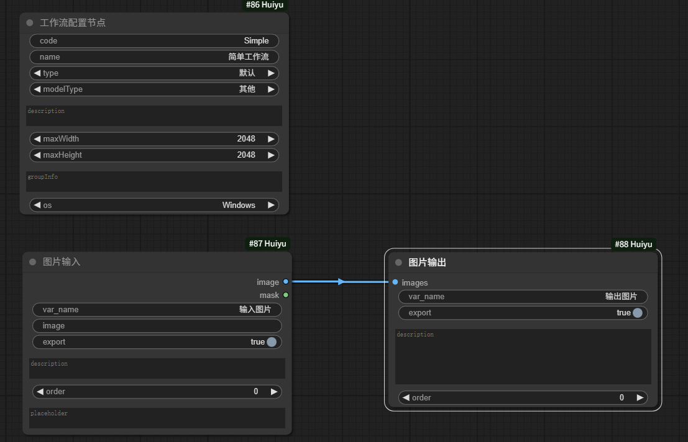
   2. 其他例子1 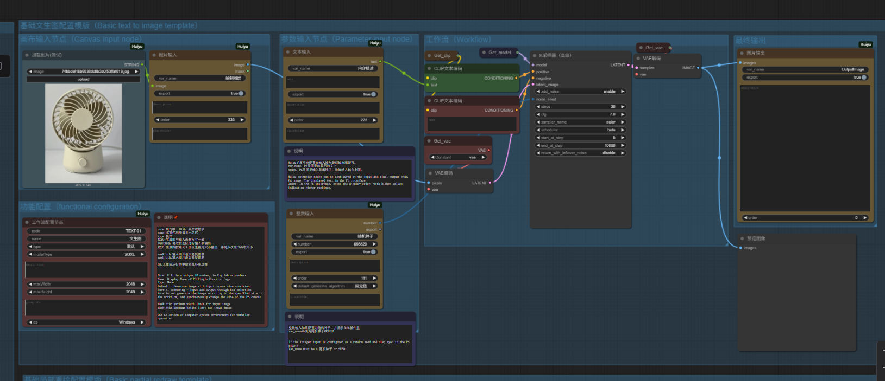
   3. 其他例子2 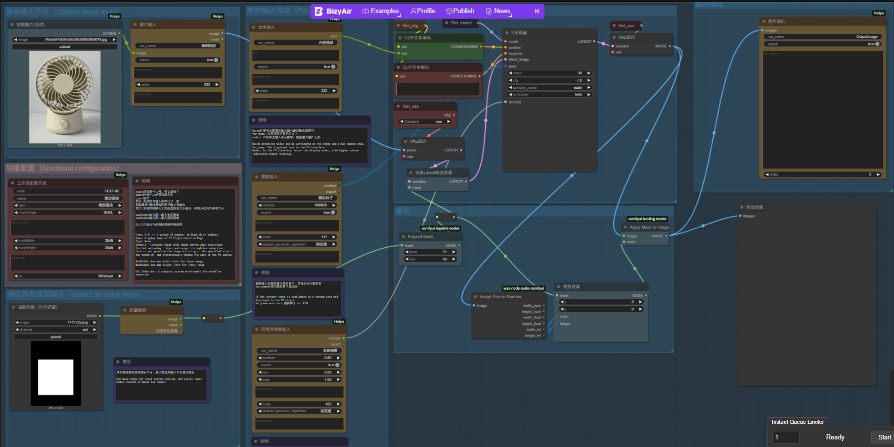
3. 点击左上角绘屿AI -> 导出配置

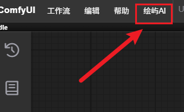

4. 启动[智慧引擎AI工具箱](https://huuuiai.com)
5. 打开本地服务器配置（点击系统右下角底部托盘）

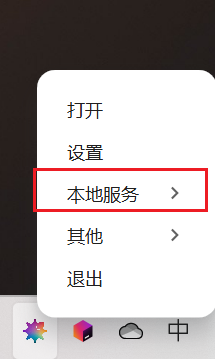
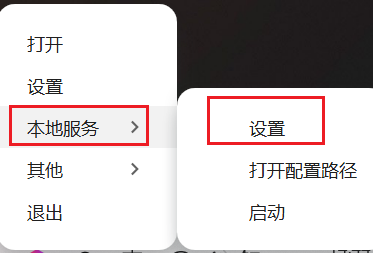

6. 填写对应信息
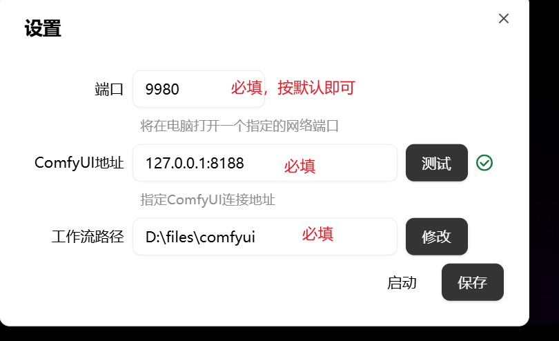

7. 把配置文件放入配置的文件夹中
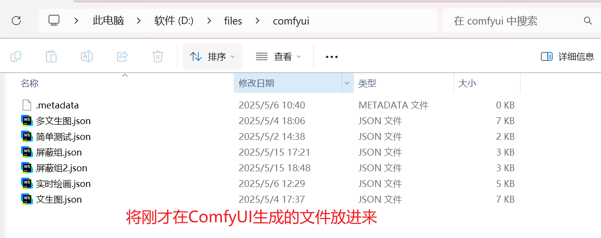

8. 启动

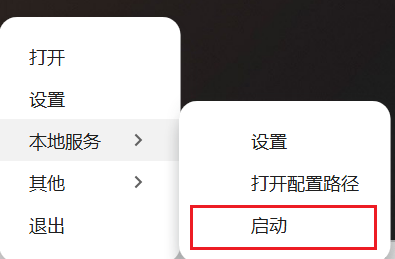

9. 刷新页面，即可看到绘屿AI节点

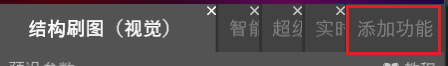
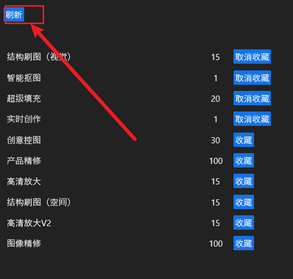
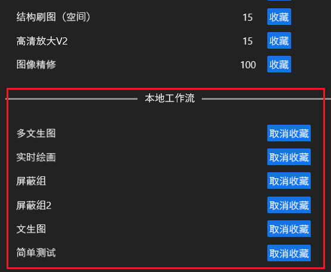

